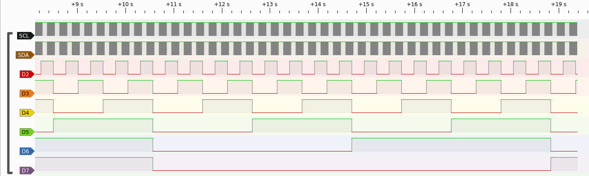
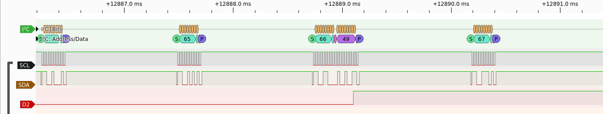

# rp2_ice_i2c

Example of integration between the iCE40 FPGA and the RP2350 MCU.

The RP2350 sends a continuous I2C scan and the FPGA acknowledges it which the RP2350 detects,
and prints logs on the USB console:

```
i2c scan: 0x66
i2c scan: 0x66
i2c scan: 0x66
i2c scan: 0x66
i2c scan: 0x66
```

You can change the I2C address in the `rtl/main.v` file.

The FPGA design is built automatically in the process of building the firmware by the CMakeLists.txt.

The FPGA binary will then be included in a C array, loaded by the RP2350 at runtime into the FPGA.

## Installing the FPGA toolchain

It needs [oss-cad-suite](https://github.com/YosysHQ/oss-cad-suite-build) installed.

For instance, if downloading oss-cad-suite in `~/oss-cad-suite`

```
source ~/oss-cad-suite/environment
```

## Building the firmware and FPGA image

Then you may be able to build it like a normal pico-sdk project:

```
cmake -B build -DPICO_BOARD=pico2_ice
cmake --build build
```

Then, you may program the RTL into your board:

```
picotool load -f build/rp2_ice_i2c.uf2
picotool reboot
```

## Debugging the FPGA
While building the firmware, the [`iverilog`](https://steveicarus.github.io/iverilog/) tool will be launched,
simulating the FPGA design, and producing a `build/top_simulation.vcd` output for inspection.

You can use tools such as [`gtkwave`](https://github.com/gtkwave/gtkwave) to inspect the output.

The Pmod A of the pico2-ice sends debug signals, which allows to plug it to a logic analyzer to review
(taking care of not inserting any GND pin in the 3.3V).

Example output with [PulseView](https://sigrok.org/wiki/Pulseview):




