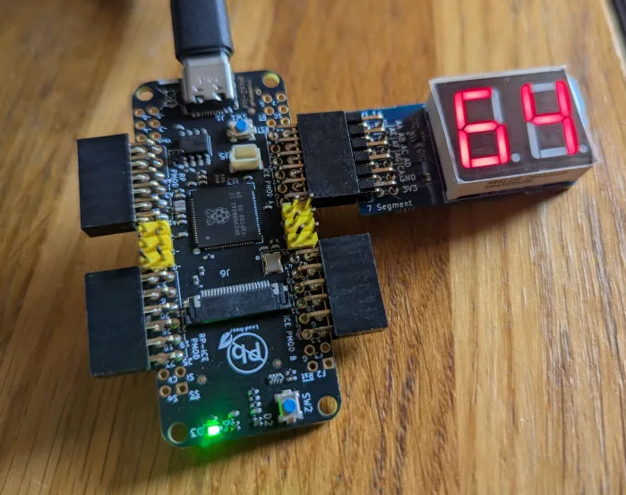

# rp2_ice_i2c_7seg

Example of integration between the iCE40 FPGA and the RP2350 MCU along with a 7-segment display for feedback.

The RP2350 sends a continuous I2C scan and the FPGA acknowledges it which the RP2350 detects,
and prints logs on the USB console:

```
i2c scan: 0x66
i2c scan: 0x66
i2c scan: 0x66
i2c scan: 0x66
i2c scan: 0x66
```

You can change the I2C address in the `rtl/main.v` file.

The FPGA will then display the data sent by the Raspberry Pi the address on the 7-segment display.

The FPGA design is built automatically in the process of building the firmware by the CMakeLists.txt.

The FPGA binary will then be included in a C array, loaded by the RP2350 at runtime into the FPGA.

## Crafting

Connect the 7-segment display to the pico2-ice board in the connector named `ICE PMOD A`.

The digits of the 7-segment display should be visible on the same side as the USB connector:



## Installing the FPGA toolchain

It needs [oss-cad-suite](https://github.com/YosysHQ/oss-cad-suite-build) installed.

For instance, if downloading oss-cad-suite in `~/oss-cad-suite`

```
source ~/oss-cad-suite/environment
```

## Building the firmware and FPGA image

Then you may be able to build it like a normal pico-sdk project:

```
cmake -B build -DPICO_BOARD=pico2_ice
cmake --build build
```

Then, you may program the RTL into your board:

```
picotool load -f build/rp2_ice_i2c.uf2
picotool reboot
```
